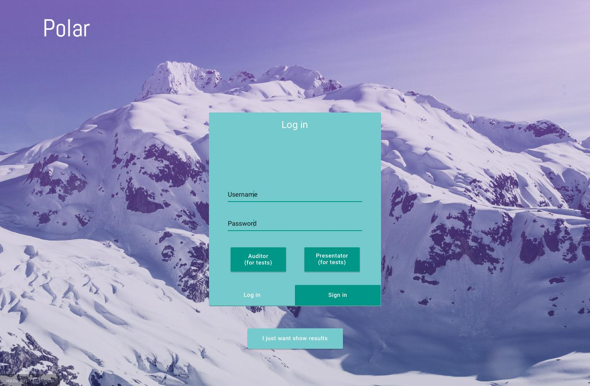

# TWEB Lab 2 - Interactive Polls

## Introduction

In this lab, we are asked to present everything we will implement in our `Interactive Polls` project. The final project will allow speakers to interact with an audience by asking questions that the auditors can answer to. While the audience send their answers, the speaker who asked the question can see real time statistics about the answers.

There is the list of main features asked for friday december 9th:

- This README file with:
	- A list of people working on this project.
	- Techs and frameworks used in this project.
	- Instructions to run the project in a local environment (with the prerequisites).
	- Mockups of the final UI (with screen transitions).
	- A link to the <del>past</del> landing page.
- No commit from any dependancy.
- No hard config in the code.
- A landing page that:
	- Anyone can access from the web.
	- Must use a nice HTML template.
	- Must be written for the end user of the project, as for a real project and not a lab.
	- Must describe the project as it will be in its final state.
	- Must contain images of the interface (muckups are allowed if the final interface is not yet ready).

### People working on this project
We are 3 student of the HEIG-VD (_Yverdon, Switzerland_) working on this project:

- Henrik Akesson (_AkessonHenrik_)
- Toni Dias (_ToniDias_)
- Bryan Perroud (_Brybry16_)

### Frameworks and techs
Interactive Polls use the following frameworks and techs:

- MongoDB
- Express
- Angular 2
- Node.js
- Github Pages

## Run the project in local

### Requirements

To run Interactive Polls on your computer, you will need to install the following on your computer.

- npm (_latest version_)
- MongoDB (_latest version_)
- Express (_latest version_)
- Angular 2
- Node.js (_latest version_)

To build the project, you need to install the following tools.

- npm (_latest version_)
- Bower (_latest version_)
- Grunt (_latest version_)

### Deployment

1. Clone this repository
2. Make sure you have a terminal session opened in the root directory of this repository cloned
3. Run the following commands:

  ```bash
bower install
grunt
  ```

4. Open a browser and go to `localhost:8080`
## UI mockups

We will use the benefits of Material Design to have a clear and simple UI. The main page will look like this:



You will find the remaining mockups in our **[invision presentation](https://projects.invisionapp.com/share/7X9O02AMV)**. This lets you interact with the mockups to see how we will handle the navigation flow. 

## Landing page

You can access our landing page by visiting **[the following link](https://akessonhenrik.github.io/Polar/)**.