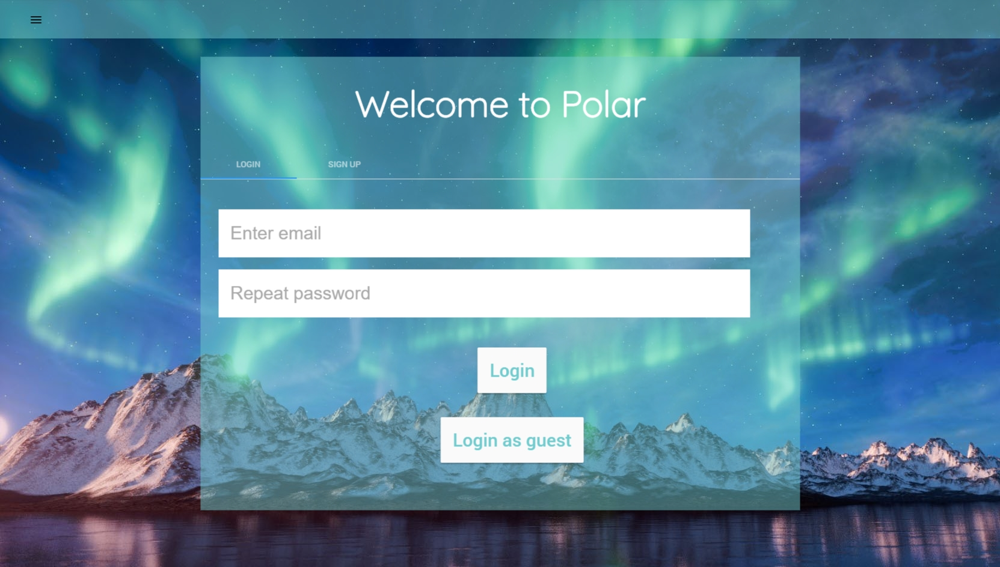
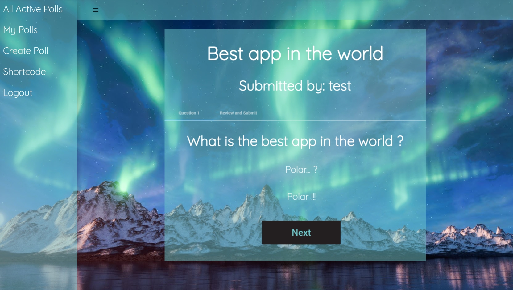

# TWEB Lab 2 - Interactive Polls

## Introduction

In this lab, we have had to develop an `Interactive Polls` project that allows speakers to interact with an audience by asking questions that the auditors can answer to. While the audience send their answers, the speaker who asked the question can see real time statistics about the answers.

Here is the list of main features asked for **friday december 9th**:

- This README file with:
	- A list of people working on this project.
	- Techs and frameworks used in this project.
	- Instructions to run the project in a local environment (with the prerequisites).
	- Mockups of the final UI (with screen transitions).
	- A link to the <del>past</del> landing page.
- No commit from any dependancy.
- No hard config in the code.
- A landing page that:
	- Anyone can access from the web.
	- Must use a nice HTML template.
	- Must be written for the end user of the project, as for a real project and not a lab.
	- Must describe the project as it will be in its final state.
	- Must contain images of the interface (muckups are allowed if the final interface is not yet ready).

We had to finish the implementation of this project for **wednesday january 25th**. Here are the evaluation criterias:

- The application (and the landing page) must be online, for example hosted on Heroku. The landing page can be hosted on another server than the main application (for example on GitHub Pages).
- **Upload and deliverables quality (1 point):**
	- This is all the features we had to implement for the first deadline.
- **Functionnal variety (1.5 points):**
	- The application must allow to create polls and anser questions.
	- The application must allow to consult real-time datas (with socket.io or any equivalent technology).
	- The application must show visual datas (graphs, ...).
	- A portion of the application must allow interactions between the polls creator and the participants.
- **Interface quality (1 point):**
	- Must have a good design (nice HTML template).
	- The application must be simple and quick to use for a class or a conference room. We have to suppose that we don't know who will take part of the polling session, and that most of the users are new to our application.
	- The interface must be as simple and intuitive as possible.
	- The landing page must present the final stage of the project. If the previous landing page had mockups, they must be replaced by actual screen captures.
- **Presentation quality (1.5 points):**
	- The presentation must be distinct and well structured.
	- The presentation medium must be done with care (content and form).
	- The demonstration scenario must be clear.
	- Our presentation must describe the aspects of our application which are not yet finished, and how they should be improved (for example: we don't need a perfect security, but we need to be capable to describe what needs to be improved).

### People working on this project
We are 3 student of the HEIG-VD (_Yverdon, Switzerland_) working on this project:

- Henrik Akesson (_AkessonHenrik_)
- Toni Dias (_ToniDias_)
- Bryan Perroud (_Brybry16_)

### Frameworks and techs
Interactive Polls use the following frameworks and techs:

- MongoDB
- Express
- Angular 2
- Node.js
- Material 2
- Chart.JS
- Github Pages

## Run the project in local

### Requirements

To build and run  Interactive Polls on your computer, you need to install the following tools on your computer.

- npm (_version 2.15.9_)
- angular-cli (_version 1.0.0-beta.22-1_)
- Node (_version 4.5.0_)
- MongoDB (_version 3.4.1_)

### Deployment

* Clone this repository
* Make sure you have a terminal session opened in the root directory of this repository cloned

#### Database

Start by running MongoDB. To do so, simply run the following command in a shell:

  ```bash
mongod
  ```

The database will now run on port `27017`.

#### Server

When the database is running, go into the `server` folder and run the following commands to start the server:

  ```bash
npm install
npm start
  ```

The server will now run on port `3030`.

#### Client

Finally, start the client by going to the `client` folder and running the following commands:

  ```bash
npm install
npm start
  ```

You are now ready ! Open a browser and go to `localhost:4200` to enjoy Polar !

### Note about deploying Polar
URLs are set by default as:

* `http://localhost:3030` for the `server` application
* `http://localhost:4200` for the `client` application

If you want to change any of these values, you can simple edit the file `client/src/environements/environement.ts` and set another default URL for the client, the server or both of them !
## User Interface

We use the benefits of Material Design to have a clear and simple UI. The main page looks like this:





You will find some other UI screen captures in our **[Landing Page](https://akessonhenrik.github.io/Polar)**. This way, you'll be able to check how Polar will revolutionize the Polling world.. ! 

## Landing page

You can access our landing page by visiting **[the following link](https://akessonhenrik.github.io/Polar/)**.

## Test Polar

If you want to test Polar, you can use **[the following link](https://akessonhenrik.github.io/Polar/)**. But be aware it is still in beta testing, even if it is fully functionnal... !